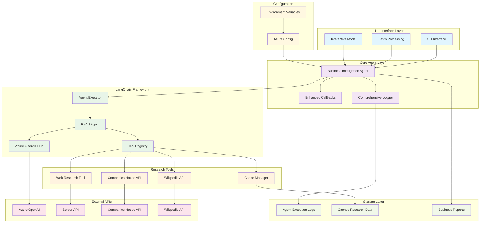

# Business Intelligence AI Agent - Architecture Documentation

## 🏗️ System Architecture Overview

The Business Intelligence AI Agent is a comprehensive research automation system that leverages multiple data sources and AI capabilities to provide structured company intelligence reports.

## 📊 Architecture Flow Diagram



## 🔄 Execution Flow

### 1. **Initialization Phase**
```
User Input → CLI Parser → Configuration Loading → Agent Initialization → Tool Registration
```

### 2. **Research Phase**
```
Company Query → Cache Check → Multi-Source Research → AI Analysis → Structured Output
```

### 3. **Logging Phase**
```
Session Start → Action Logging → Chain Execution → Result Capture → File Generation
```

## 🛠️ Tech Stack

### **Core Technologies**
| Component | Technology | Version | Purpose |
|-----------|------------|---------|---------|
| **AI Framework** | LangChain | >=0.1.0 | Agent orchestration and tool management |
| **Language Model** | Azure OpenAI | GPT-4 | AI reasoning and text generation |
| **Programming Language** | Python | 3.8+ | Core implementation |
| **Web Scraping** | BeautifulSoup4 | >=4.12.0 | HTML parsing and content extraction |
| **HTTP Client** | Requests | >=2.31.0 | API calls and web requests |

### **External APIs**
| Service | Purpose | Rate Limits |
|---------|---------|-------------|
| **Azure OpenAI** | AI inference and reasoning | Varies by tier |
| **Serper API** | Google search capabilities | 2,500 queries/month (free) |
| **Companies House API** | UK company registration data | No rate limit |
| **Wikipedia API** | Company background information | No rate limit |

### **Data Storage**
| Type | Format | Location | Retention |
|------|--------|----------|-----------|
| **Agent Logs** | JSON + TXT | `./business_intel_output/agent_logs/` | Indefinite |
| **Cached Research** | JSON | `./business_intel_output/` | 24 hours default |
| **Business Reports** | TXT | `./` (current directory) | User-managed |

### **Configuration Management**
| File | Purpose | Format |
|------|---------|--------|
| `azure_config.json` | API credentials and endpoints | JSON |
| `requirements.txt` | Python dependencies | Text |
| Environment Variables | Runtime configuration | Shell variables |

## 🏗️ Detailed Component Architecture

### **1. CLI Interface Layer**
```python
main() → setup_agent() → interactive_mode() / batch_mode() / single_query()
```
- **Responsibilities**: User interaction, command parsing, mode selection
- **Input Validation**: Company names, file paths, session IDs
- **Output Formatting**: Console display, file operations

### **2. Business Intelligence Agent**
```python
BusinessIntelligenceAgent {
    - config: EnhancedBusinessIntelligenceConfig 
    - logger: AgentExecutorLogger  
    - callbacks: BusinessIntelligenceCallbacks
    - tools: [CompanySearchTool, WikipediaResearchTool, WebResearchTool, CacheManager]
    - llm: AzureChatOpenAI
    - agent_executor: AgentExecutor
}
```

### **3. Tool Architecture**
Each research tool follows a consistent pattern:

```python
class ResearchTool:
    def __init__(self, config)
    def research_method(self, company_name, location) -> Dict[str, Any]
    def _validate_input(self, input) -> bool
    def _process_results(self, raw_data) -> structured_data
```

### **4. Logging System Architecture**
```python
AgentExecutorLogger {
    - session_management: start_session(), end_session()
    - action_logging: log_agent_action(), log_agent_finish()
    - output_capture: stdout/stderr redirection
    - file_generation: JSON + human-readable formats
}
```

## 📈 Data Flow Architecture

### **Research Data Pipeline**
```
1. Query Input
   ↓
2. Cache Validation
   ↓
3. Multi-Source Data Gathering
   ├── Companies House API
   ├── Wikipedia API  
   └── Web Search + Scraping
   ↓
4. AI Analysis & Synthesis
   ↓
5. Structured Output Generation
   ↓
6. Caching & Logging
```

### **Logging Data Pipeline**
```
1. Session Initialization
   ↓
2. Real-time Action Capture
   ├── Tool Calls
   ├── AI Reasoning
   ├── Console Output
   └── Error Handling
   ↓
3. Output Redirection
   ↓
4. Session Finalization
   ↓
5. Multi-format File Generation
   ├── agent_log_SESSION.json
   └── agent_log_SESSION.txt
```

## 🔐 Security & Configuration

### **API Key Management**
```json
{
  "azure_openai_api_key": "••••••••",
  "azure_openai_endpoint": "https://••••.openai.azure.com/",
  "serper_api_key": "••••••••"
}
```

### **Error Handling Strategy**
- **Graceful Degradation**: Continue with available tools if one fails
- **Comprehensive Logging**: All errors captured in session logs
- **User Feedback**: Clear error messages with actionable guidance
- **Retry Logic**: Built into web requests and API calls

## 📊 Performance Characteristics

### **Typical Execution Metrics**
| Metric | Single Query | Batch (10 companies) |
|--------|--------------|---------------------|
| **Execution Time** | 15-45 seconds | 5-10 minutes |
| **API Calls** | 2-5 per session | 20-50 total |
| **Data Generated** | 10-50KB logs | 100-500KB logs |
| **Cache Hit Rate** | ~30% (after initial runs) | ~50% (mixed queries) |

### **Scalability Considerations**
- **Rate Limiting**: Built-in delays between requests
- **Memory Management**: Content truncation for large responses
- **Disk Usage**: Automatic log rotation recommended for production
- **Concurrent Execution**: Single-threaded by design for API compliance

## 🔍 Monitoring & Observability

### **Built-in Monitoring**
- **Session Tracking**: Unique IDs for every execution
- **Performance Metrics**: Duration, tool usage, success rates
- **Error Analytics**: Detailed error logs and stack traces
- **Usage Statistics**: Tool frequency, cache hit rates

### **Log Analysis Capabilities**
```bash
# View execution summary
--logs

# Analyze specific session
--view-log SESSION_ID

# Export for external analysis
--export-logs analysis.json
```

## 🚀 Deployment Architecture

### **Development Setup**
```
1. Clone Repository
2. Install Dependencies (pip install -r requirements.txt)
3. Configure APIs (azure_config.json)
4. Initialize Agent
5. Run Research
```

### **Production Considerations**
- **API Quotas**: Monitor usage across all services
- **Log Management**: Implement rotation and archival
- **Configuration Security**: Use environment variables
- **Error Alerting**: Monitor failed sessions
- **Backup Strategy**: Regular cache and log backups

## 🔧 Extensibility Points

### **Adding New Research Tools**
```python
class NewResearchTool:
    def research_method(self, company_name, location):
        # Implement research logic
        return structured_data
```

### **Custom Output Formats**
- Extend `save_report_to_file()` for new formats
- Add format selection to CLI arguments
- Implement format-specific templates

### **Enhanced AI Capabilities**
- Upgrade to newer LLM models
- Add specialized prompts for different industries
- Implement multi-language support

## 📋 System Requirements

### **Minimum Requirements**
- **Python**: 3.8+
- **Memory**: 512MB RAM
- **Storage**: 1GB free space
- **Network**: Stable internet connection
- **APIs**: Active Azure OpenAI and Serper accounts

### **Recommended Requirements**
- **Python**: 3.10+
- **Memory**: 2GB RAM
- **Storage**: 5GB free space
- **Network**: High-speed broadband
- **APIs**: Premium API tiers for higher limits


### **ADD Adverse media check** [TODO]
- Semantic Kernel and AI foundry 
- [LESG] [https://www.lseg.com/en/risk-intelligence/financial-crime-risk-management/adverse-media-screening]
- 
